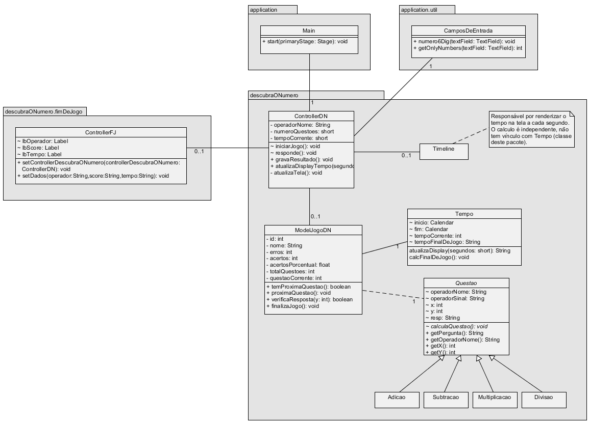

teste

# JogosAlphaFX
---
Aplicativo de jogos em javaFX. 
 
Executável -> [Download](https://github.com/fabioalves95472/jogosAlphaFX-deploy/archive/refs/heads/app.zip) (executa em java 8 e posterior, leia abaixo)
 
- Java 8: 
	- Execute:	`jogosAlphaFX.jar` 
- Java 9 (ou posterior): 
	- Execute: `executable.bat`	-> Windows 
	&emsp;`executable.sh`		-> Linux / Mac 

<!--  -->